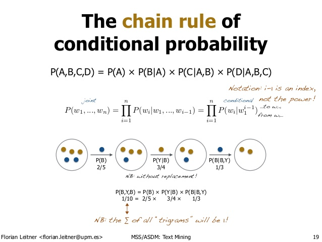

****

**Written by LeeKH***

# A Brief Review of Probability Theory

## Probability

### 1. introduction

#### 확률에 대한 2가지 관점

* "코인을 던졌을때  윗면이 나올 확률은 0.5이다"에서 '확률'이 의미하는바를 2가지로 나눠 정의 할 수 있음
  * Frequentist interpolation 으로 불리는 관점에서 확률이란, 수 많은 시행에서 사건이 발생한 회수로 정의된다. 무한히 동전을 던지면 앞면과 뒷면이 나오는 횟수가 1:1에 비례하므로 확률을 0.5로 정의하는 것이다
  * Bayesian interpolation 의 관점에서 확률은, 다음 시행에서 동전이 발생하는 사건은 앞면(head)또는 뒷면(tail) 2가지 경우가 발생할 확률이 동일하므로 0.5라고 정의하는 것이다

#### Bayesian interpolation 관점의 장점

* 극지방의 얼음이 2020년까지 녹을 확률을 구한다고 가정해볼때 long term frequency 관점에서는 이것이 일어날 수도 안 일어 날 수도 있기 때문에 확률을 규정하기가 힘들다
* 반면 Bayesian 관점에서는 이런 불확정성에 대한 확률을 규정하기 매우 편리하다

### 2. A brief review of probability theory

#### 2.1 Discrete random variables(이산 확률 변수)

* Binary event에 대한 개념을 확장시켜 discrete random variable로 생각할 수 있다. Binary event란 예를 들어, 내일 비가 올 것이다 = A 라고 할 때 A = 1 이면 비가 오는 것이고 A = 0 이면 비가 오지 않는 2가지 경우로 사건을 나누어 결정하는 방식이다

* Probability Mass Function(확률 질량 함수)를 $p()$라고 나타내고 어떤 사건의 확률 변수를 discrete random variable로 하여 $X$로 나타낸다면,

  * 사건 $x$가 발생할 확률을 $P(X = x)$ 또는 $p(x)$로 간단히 정의 가능하다

  * 확률 $p(x)$는 $0 \le p(x) \le 1$의 범위를 갖는다

  * 모든 사건에 대한 확률의 합은 $\sum_{x \in X}P(X=x) = 1$이다

    

* 상태 공간(state space)이 $X =$ {1,2,3,4,5}로 정의할 경우,

  * Uniform distribution의 확률 분포를 가질 경우 $p(x) = 1/5$이다
  * Degenerate distribution의 확률 분포를 가질 경우 $p(x) = \mathbb{I}(x=1)$라고 표기되는 경우 항상 값 1을 갖는다. $\mathbb{I}()​$는 indicator function이라고 한다. 지시함수라고 번역되어 불리기도한다. 특정 값이 집합에 속할 경우 1을, 그렇지 않은 경우 0을 가진다

  

  * 좌측 그래프는 Uniform distribution을, 우측 그래프는 Degenerate distribution을 나타내고 있다

#### 2.2 Fundamental Rules

##### a. Probability of a union of two events

* 2개의 서로 다른 사건 $A, B​$가 존재할 경우 $A​$ or $B​$의 확률을 계산하는 것을 union이라 한다
* $p(A \vee B) = p(A) + p(B) - p(A \wedge B)$로 정의 할 수 있다
* 만약 사건 $A$와 $B$가 서로 연관성이 없는 상태(Mutually Exclusive)의 경우 $p(A) + p(B)$로 정의 가능하다

##### b. Joint probabilities

* 2개의 서로 다른 사건 $A, B$가 존재할 경우 $A$ and $B$를 joint event라고 하며 이 확률 분포를 joint distribution이라 한다. 수식으로는 다음과 같이 나타낼 수 있다

  * $p(A, B) = p(A \wedge B) = p(A|B)p(B)​$

  * $p(A,B) = p(A|B)p(B)$로 나타내는 것을 product rule이라고 부른다

    

* 특정 사건 $A$의 확률을 연관된 사건 $B$와 함께 고려하는 경우 joint distribution의 합으로 표현 가능한 marginal distribution을 다음과 같이 표현한다

  * $p(A) = \sum_{b}p(A, B) = \sum_{b}p(A|B = b)p(B=b)$

  * Joint distribution에 product rule을 적용하여 위 공식과 같이 표현이 가능함

  * Sum rule 또는 rule of total probability 라고 불린다

    

* Product rule을 여러번 적용 가능한데 이런 경우를 chain rule of probability라고 한다. 간단하게 3개 사건 $A, B, C$에 대해서 joint distribution을 chain rule로 풀어쓰면 아래와 같다

  

$$
p(A,B,C) = p(A|B,C)p(B,C)=p(A|B,C)p(B|C)p(C)
$$

  [출처: Text mining - from Bayes rule to dependency parsing, Florian Leitner]

* 위 그림은 조건부 확률과 Chain rule의 예시를 노란색(Y), 파란색(B)공을 꺼내는 예시로 잘 보여주고 있다

  * 파란공 2개 노란공 1개를 꺼내는 확률은 $P(B,Y,B)$로 볼 수 있다

  * 공을 꺼내는 과정을 단계별로 표현하는 것과 chain rule을 통해 풀어나가는 방식과 동일하다는 것을 볼 수 있다

    

##### c. Conditional probability

* 사건 $A$가 주어진 사건 $B = True$인 경우의 확률을 조건부 확률(Conditional prob)이라고 한다
* 사건 $B$가 발생해야 한다는 것이 조건으로 작용한다
* 아래와 같이 표현 가능하다

  * $p(A|B) = \frac{p(A, B)}{p(B)}$ if $p(B) > 0$

    

##### d. Bayes rule

* Bayes rule이라고 불리는 이것은 3가지 정의를 함께 사용한다
  * Conditional Probability

  * Product Rule

  * Sum Rule 

    

* Conditional Probability $p(A|B)$ 는 Joint probability인 $p(A,B)$ 에 조건 B의 확률 $p(B)$를 나눈 값으로 표현이 가능하다

  * Joint probability $p(A,B)$(=$p(B,A)$)는 product rule을 적용하면 아래 2가지 식으로 표현이 가능하다
    * $p(A|B)p(B)​$
    * $p(B|A)p(A)$ 
    * 두가지로 표현이 가능하지만 첫번째 공식의 경우 수식에 변화가 없으므로 두번째 표현식을 사용한다
  * 사건 $B$의 확률 $p(B)$는 사건 $A$에 대한 marginal distribution으로 표현하는 경우, sum rule을 적용하면 아래와 같이 표현이 가능하다

    * $p(B) = \sum_{a \in A} p(A=a)p(B|A=a)$

      

* 다시, Conditional Probability $p(A|B)$를 위 두가지 기법을 각각 적용한 결과 아래와 같은 수식들을 얻을 수 있고 이를 **Bayes rule, Bayes Theorem** 이라고 한다

  

  $$
  p(A|B) = \frac{p(A,B)}{p(B)} = \frac{p(B|A)p(A)}{p(B)} = \frac{p(B|A)p(A)}{\sum_{a \in A} p(A=a)p(B|A=a)}
  $$

##### e.Example (Cancer Detection Problem)

* 확률 변수 $X$를 암 검진 테스트 결과라고 하고, $Y​$는 실제 암의 발병 여부라고 하자

* 암 검진 테스트기의 Sensitivity를 80%라고 하자. 이것이 의미하는 것은 검진 대상자가 실제로 암에 걸린 상태($Y = 1$)에서 테스트기의 성공 확률($X=1$)이 0.80임을 의미한다. 즉 조건부 확률이다

  * $p(X=1|Y=1) = 0.80$

    

* 사전 확률 $p(Y=1)$은 실제로 암에 걸렸을 확률이다. 암 검진 테스트시 양성일 확률이 80%라는 것은 대상이 실제로 암에 걸렸을 확률을 의미하는 것은 아니다. 이는 사전 확률을 고려하지 않고 생각하는 대표적인 오류(**base rate fallacy**)다. 다행히도 사람이 실제 암에 걸리는 확률은 0.4%라고 하자

  * $p(Y = 1) = 0.004$

    

* 테스트기가 오작동 하는 확률은 어떻게 계산할 수 있을까? 오작동하는 경우의 조건부 확률은 아래 2가지 경우로 볼 수 있다

  * False Positive(암에 안걸렸는데 암이라고 판단한 경우) : $p(X=1|Y=0) = 0.1$

  * True Negative(암에 걸렸는데 암이 아니라고 판단한 경우) : $p(X=0|Y=1) = ??$

    

* 그럼 실제로 내가 암에 걸렸을 확률은 어떻게 구할 수 있을까? 이는 암 검진 테스트를 했을 경우 양성으로 판단되어야 하는 전제 조건을 갖는다고 하자. 아래와 같이 정리할 수 있다

  

* ***테스트 결과가 양성일 경우 실제로 암일 확률은 3%에 불과하다***

  

#### 2.3 Example: Generative Classifier

* 암 진단 문제를 어떤 임의의 특징 벡터 $\mathbb{x}$를 분류하는 문제로 일반화 시킨다고 생각할 경우,

  

  $$
  p(y=class|\mathbb{x},\theta) = \frac{p(y=class|\theta)p(\mathbb{x}|y=class,\theta)}{p(\mathbb{x}|\theta)} = \frac{p(y=class|\theta)p(\mathbb{x}|y=class,\theta)}{\sum_{c'}p(\mathbb{x}|y=c',\theta)p(y=c'|\theta)}
  $$

  

* 이와 같은 모델을 Generative Classifier라고 한다

* Generative 모델로 불리는 이유는 class-conditional density $p(\mathbb{x}|y=c)$와 class prior $p(y=c)$를 사용하여 어떻게 data를 generate하는지 명시하고 있기 때문이다(?)

* Class Posterior $p(y=c|\mathbb{x})$ 를 바로 fit하는 방식도 있는데 이는 disciriminative classifier로 알려져 있다    

## References

- Machine Learning A Probabilistic Perspective, Kevin P. Murphy, 2012