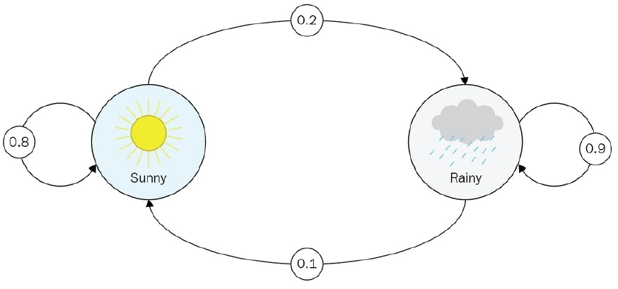
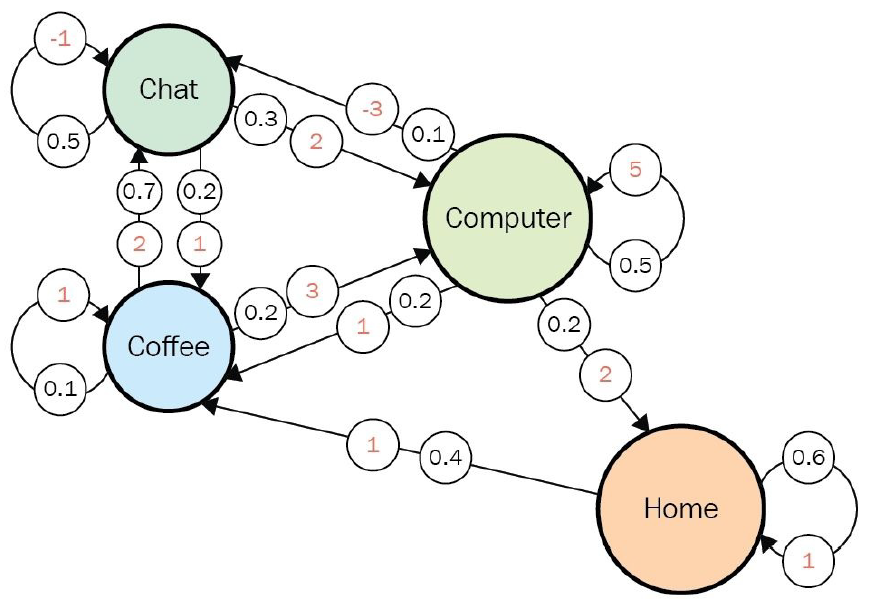
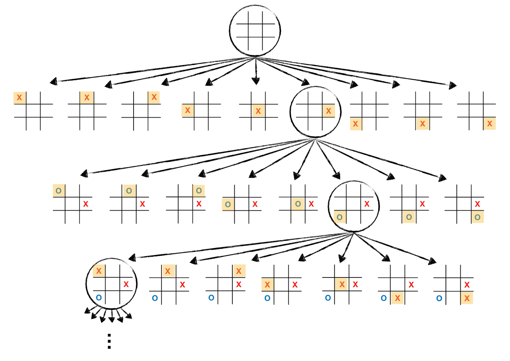
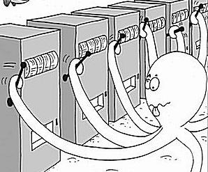
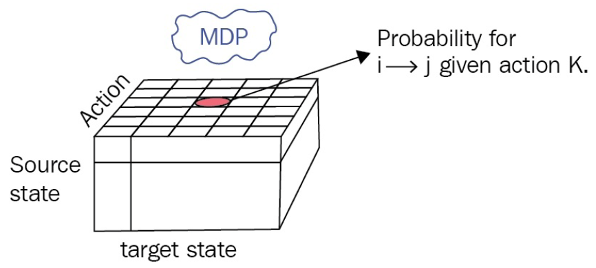
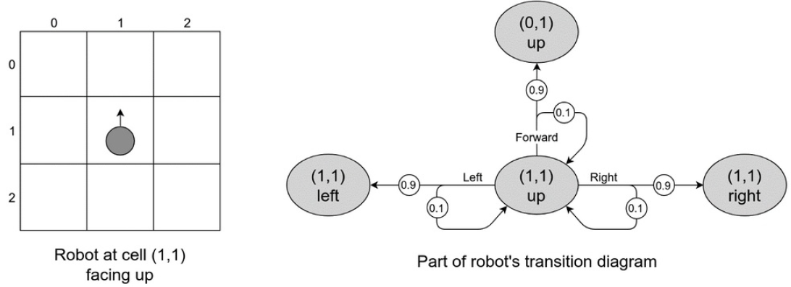

***Written by LeeKH***

# About the Markov Decision Process(MDP)

## 1. introduction

* Reinforcement Learning의 이론적 기반을 이루고 있다

* 가장 간단한 경우의 MDP를 Markov Process(MP)라고 부른다

* MP에 보상(reward)의 개념을 추가하면 Markov Reward Process 라고 부른다

* 여기에 행동(action)의 개념을 추가하면 Markov Decision Processes(MDPs)로 불리게 된다

* MDP는 컴퓨터 과학 분야 뿐만 아니라 다른 영역에서도 활발히 사용된다. 이는 MDP를 기본으로 하는 RL을 다양한 분야에 적용할 수 있는 이유이기도 하다

  

## 2. Markov Process(MP)

* 가장 심플한 형태의 MDPs를 Markov Process 또는 Markov Chain이라고 함
* 어떤 시스템이 존재하고 그것을 관측 할 수 있다면 이를 상태(state)라고 한다
* 상태(state)의 집합, 모든 가능한 상태들을 State Space라고 부른다
* State Space는 유한해야한다. 단, 그 크기가 계산할 수 없을 만큼 클 수는 있다
* Observation은 관측되는 상태들을 의미하며 상태(state)의 리스트 혹은 나열로서 표현된다(sequence of states, chain). 이것이 Markov Process 혹은 Markov Chain으로 불리는 이유이다
* 이러한 Observation들의 리스트, 시퀀스를 강화학습(RL)에서는 history라고 부른다
* 특정 시스템이 Markov Process로 불리기 위해서는,
  * Markov Property를 만족해야한다
  * 이는 시스템의 다음 상태를 결정하기 위해서 필요한것이 오직 상태(state)뿐인 경우를 의미함
* 각 상태와 상태로 이동할 수 있는 확률(Transition Probabilities)들로 구성된다

* 위 그림이 대표적인 Markov Process이다. 날씨를 예측하는 아주 간략한 모델이다. 고려되는 것은 현재 상태의 날씨 뿐이며 현재 날씨에서 다음 날씨로 변동되는 상태 이동 확률을 기반으로 상태가 변경된다

* 만약 상태 이동 확률(probability of transition)이 0이면 edge를 그릴 필요는 없다

* MP에서는 각 상태(state)들을 정의하고, 관측(observation)된 정보들(history)을 바탕으로 상태이동확률(transition prob.)을 계산하는 것으로 위의 그림과 같은 Markov Process(Markov Chain)을 구성하게 된다

  

## 3. Markov Reward Process(MRP)

* 해당 모델은 Markov Process에서 보상(Reward)의 개념이 추가된 버전이다

* 상태(state)에서 다른 상태로 이동(transition)하는 경우에 보상이 주어지는 것으로 볼 수 있다

* Transition Matrix(가능한 모든 상태 이동 확률을 기록한 테이블)와 같은 크기로 확률 대신 보상을 기입한 테이블을 갖는다

* 보상의 개념과 함께 오는 것은 discount factor $\gamma​$ 이다. 0과 1사이의 값이며 미래의 보상을 계산할때 사용되는 상수다

* MRP는 MP에서 확장된 개념이므로 여전히 상태 이동 기록들을 관측(observe a chain of state transitions)하게 된다. MP에서는 이를 확률 계산에만 사용하면되지만 보상의 개념이 추가된 MRP에서는 이 history를 바탕으로 전체 보상인 return을 계산하게 된다 

* 한번의 return이 주어지는 history를 episode라고 한다

$$
  G_{t} = R_{t+1} + \gamma R_{t+2} + ... = \sum_{k=0}^\infty\gamma^{k}R_{t+k+1}
$$

* return의 의미는 현재 상태에서 받는 보상과는 개념이 다소 다르다. 이는 미래에 받게될 보상의 기대치로 생각을 할 수 있다. 미래의 보상에 감소율인 $\gamma$를 계속 곱해 너무 멀리 바라보거나($\gamma = 1$), 당장의 보상만 바라보는($\gamma = 0$) 중간의 정도를 계산하는 수식을 (1)에서 보여주고 있다

* 강화학습에서 $\gamma​$(discount factor)를 간단히 설명하사면, agent가 이후의 보상을 고려할 경우 미래를 어느정도 보고 결정할 것인지에 대한 상수 값으로 볼 수 있다

* Value of State, 상태에 대한 가치 값이라고 불리는 값은 곧 무수히 많이 수집된 chain들(관측 결과들)을 바탕으로하는 기대치로 정의할 수 있다
  $$
  V(s) = E[G|S_{t} = s]
  $$

* 수식(2)가 의미하는 바는 간단하다. 모든 상태 s에 대해서 얻게되는 return값인 G들의 평균 혹은 기대값을 곧 상태의 가치(Value of State)로 정의하는 것이다
* $\gamma$의 값을 0으로 하는 것과 1로 하는 것 또는 그 사이의 값으로 결정하는 요인은 각 환경마다 다르다고 볼 수 있다

* 위 그림은 Dilbert Reward Process이다. 이 경우 $\gamma$의 값이 0이면 각 state에서 얻을 수 있는 즉각적인 보상에만 집중하게 될 것이고 $\gamma$의 값이 1이 되면 미래의 보상을 계산하기 위해 무한히 transition을 수행해야한다. 이러한 예시의 경우에는 0과 1사이의 값을 적절히 선택해야할 필요가 있다

* 위 그림은 Tic-Tac-Toe 게임의 과정을 보여주고 있다. 틱택토는 보통 9번의 state변화 이후 게임이 종료되는데, 이러한 환경을 finite-horizon environment라고 정의하고 있다. 이런 문제의 경우 $\gamma$를 1로 해도 상관이 없다. 오히려 좋다

* 다른 예시로 Multi-Armed Bandit MDP가 있다. 이 예시에 대한 자세한 설명은 생략하고 핵심만 말하자면 한번의 슬롯을 당기는 것으로 하나의 episode가 끝이난다. 이러한 경우에는 $\gamma$를 0으로 설정하게 될 것이다

  

## 4. Markov Decision Process(MDP)

- 해당 모델은 Markov Reward Process에서 행동(Action)의 개념이 추가된 버전이다

- 모든 행동들의 집합을 agent의 action space라고 한다. Action의 개수는 유한해야 한다

  

- MPs(Markov Processes)와 MRPs(Markov Reward Processes)에서 고려되던 transition probability matrix는 action 개념이 추가되면서 큐브형태의 transition probabilities for MDP를 위 그림처럼 생각해 볼 수 있다

  

* Agent를 로봇이고 그 로봇은 불완전한 엔진을 갖고 있어 방향 전환에 성공할 확률을 갖고 있다고 생각 해 볼 수 있다. 이는 행동을 선택하는 것에도 확률이 들어가게 되는 것이다

* 위 그림은 GridWorld위 (1,1)에 있는 로봇이 행동 할 수 있는 모든 다음 상태들을 action probabilities과 함께 표시한 다이어그램이다

* RL과 MDPs를 수식으로 정의하는데 있어 핵심적으로 다뤄지는 것이 정책(policy)이다

* 정책(policy)은 agent의 행동을 결정하는 규칙으로서 작동한다

* 강화학습의 목표는 최적의 정책(optimal policy, $\pi^{*}$)을 찾아 더 많은 return을 얻는 것이다. 정책에 따라 agent는 행동을 수행하기 때문에 정책에 따라 return의 값이 역시달라진다고 볼 수 있다. 따라서 정책의 개념(notion of policy)을 결정하는 것은 매우 중요하다. 

$$
  \pi(a|s) = P[A_{t}=a|S_{t}=s]
$$

* 수식으로 보자면, 정책은 모든 가능한 상태들에 대한 행동의 확률 분포로 볼 수 있다. 보다시피 행동은 고정된 값이 아닌 무작위성을 지닌 확률 값으로 결정된다. 

* 확률적 행동 접근은 무작위성 탐색폭을 가능하게 함으로서 더 나은 정책을 찾는데 도움을 주게 된다

* 만약 정책의 값이 변화하지 않고 고정된 값이라면, MDP는 곧 MRP로 볼 수 있다

  

## References

- Deep Reinforcement Learning Hands-On, Maxim Lapan, 2018

