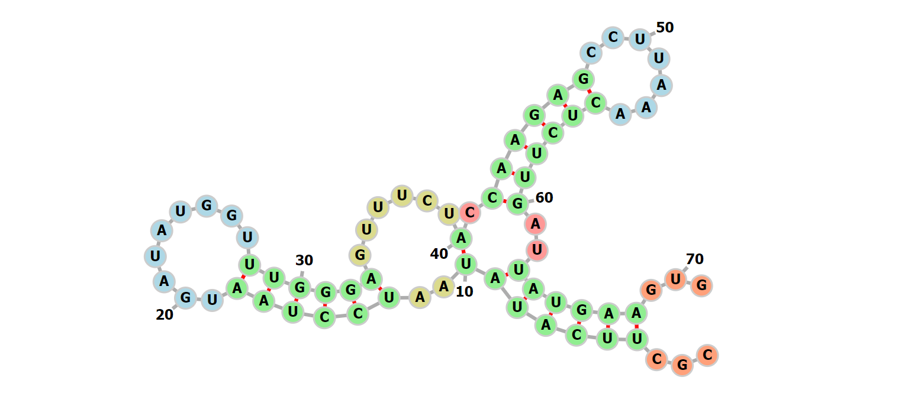

***Written by LeeKH***

# Markov Decision Process For Predict RNA Secondary Structure #1

## 1. Introduction

### 1.1 Markov Decision Process(MDP)

마르코프 결정 과정(Markov Decision Process)은 의사 결정 과정을 모델링하기 위한 수학적인 틀을 제공한다. 주로 동적계획법이나 강화학습으로 최적화 문제 풀이에 유용한 도구로 사용된다. 여기서는 강화학습에 맞춰 마르코프 결정 과정을 살펴본다

### 1.2 Reinforcement Learning(RL)

강화 학습은 기계학습의 한 영역으로서 행동 심리에서 영향을 받은 학문이다. 어떤 환경 안에서 현재의 상황을 인식하고 보상을 최대로 하는 행동의 순서를 학습하는 방식이다.  "근사 동적 계획법"이라고도 불린다. 또한 강화학습에서 "환경"으로 불리는 요소는 마르코프 의사 결정 과정으로 주어진다. 하지만 강화학습이 MDP와 다른점은 아래와 같다

- 강화학습은 마르코프 의사 결정 과정에 대한 지식을 요구하지 않는다
- 강화학습은 크기가 매우 커서 결정론적 방법을 사용할 수 없는 규모의 마르코프 결정 문제를 다룬다

강화학습은 기계학습 분야에서 분류되는 (지도, 비지도 학습)지도 학습처럼 정답이 직접적으로 주어지고 그것에서 생기는 오류를 수정하는 방식은 아니다. 강화학습의 초점은 학습과정(on-line)에서의 성능이다. 강화 학습은 아직 조사되지 않는 영역을 탐험하는 것과 이미 알고 있는 지식을 이용하는 것의 균형을 잡는 것이다.

### 1.3 Reinforcement Learning with Example

미로(Environment)속의 로봇(Agent)이 특정 상황(State)에서 수행하는 행동(Action)을 바탕으로 출구를 찾으면 점수(Reward)를 얻는 상황을 예시로 살펴보자 

#### - $State$(상태 집합)

로봇이 방문하게 되는 특정 위치로 볼 수 있다. 미로가 N x N 사이즈의 격자로 구성되어 있다면 가능한 상태는 움직일 수 있는 모든 격자 공간 위의 위치가 된다 

#### - $Action$(행동)

마찬가지로 N x N 사이즈의 격자로 구성된 미로의 경우 로봇이 취할 수 있는 행동은 {상, 하, 좌, 우} 방향으로 움직이는 행위들이다

#### - $Reward$(보상)

미로에서 탈출하기 위해서는 탈출구가 있는 특정 지점에 도착해야한다. 도착하는 경우 점수를 획득하는등의 행위를 보상으로 볼 수 있다

#### - $Policy$(정책)

Agent에 해당하는 로봇은 보상을 최대화 하는 방향으로 현재 상황(s)에서 행동(a)를 결정하기위해 정책에 따라 행동을 결정한다

#### - $Environment$(환경)

보상과 다음 상태를 넘겨주는 미로가 곧 환경을 의미한다. Agent인 로봇은 미로와 상호작용한다. 

- 로봇은 현재 상태에서 생각할 수 있는 최선의 선택을 한다
- 환경은 로봇이 선택한 행동에 따른 보상과 다음 상태를 제공한다.

#### - 강화학습의 목적

Agent인 로봇이 최대의 보상을 받을 수 있도록 정책(Policy)를 학습하는 것이다. 포괄적인 의미로, 이 정책을 학습하는 과정에서 사용되는 다양한 방법들이 강화학습의 알고리즘들이다

### 1.4 RNA Secondary Structure Prediction

최근의 RNA 2차 구조 예측을 위한 방법들은 대부분 동적 계획법이다. 한번에 복잡한 2차 구조를 정할 수 없기 때문에 부분 문제로 나눠 해결하는 동적 계획법을 사용한다. RNA 2차 구조를 몇 가지 부분 구조로 정한 다음 재귀적으로 분류하여 가능한 모든 2차 구조에서 최소한의 자유에너지를 갖는 안정적인 구조를 선택한다. 

이 Minimum Free Energy 기반 동적 계획법은 대부분의 RNA 2차 구조 예측 서비스에서 사용되는 방법으로 실제로 의미있는 결과를 제공한다. 하지만 몇 가지 한계점은 에너지 계산 과정의 복잡함과 실험적 수치를 기반으로 계산하기에 발생하는 오차들이다. 그리고 Pseudoknot이라는 특수한 구조는 동적 계획법으로는 해결 할 수 없다. 

본 연구의 목표는 RNA의 2차 구조를 RNA sequence 데이터로 부터 예측하기 위해 강화학습 이론을 적용하는 것이다. RNA 2차 구조의 모든 2차 구조를 규명하는데 드는 계산량은 유한하지만(단, exponential하다) 정확한 구조를 선택하기 위한 기준을 정확히 명시하는것은 매우 힘들다. 때문에 학습 기반의 근사 동적 계획법을 수행 하는 것이다.

일종의 정답 데이터인 RNA 2차 구조 정보를 직접적으로 학습 시켜 (ex. Deep Learning with Supervised Learning) 예측 모델을 구성하는 것도 하나의 방법이다. 하지만 해당 방식은 학습 오류를 정확히 규명해야하는데 이것이 쉽지 않다. 이에 우리는 명시적 오류를 표현하기 힘든 RNA 2차 구조의 예측 문제를 강화학습과 접목시켜 풀이하려 한다. 

이를 위해 우선 위의 예시(미로에 갖힌 로봇)처럼 각 요소들에 대한 정의를 해볼 필요가 있다. 이와 유사하고 비슷한 접근 방식의 연구로는 RNA Design이 있다

 

## References

- 마르코프 의사 결정 과정 - https://en.wikipedia.org/wiki/Markov_decision_process

- Q 러닝 - https://en.wikipedia.org/wiki/Q-learning

- 강화학습 - https://en.wikipedia.org/wiki/Reinforcement_learning

- RNA 2차 구조 시각화 - http://rna.tbi.univie.ac.at/forna/forna.html

- 강화학습 -  http://web.stanford.edu/class/cs234/index.html

- RNA 2차 구조 -  *RNA Secondary Structures, Ivo L. Hofacker and Peter F. Stadler. Institute for Thoretical Chemistry, Universitiy of Vienna, Wahringerstrasse 17, A-1090 Vienna, Austria. Bioinformatics Group, Department of Computer Science, and Interdisciplinary Center for Bioinformatics, University of Leipzig,*
  *Hartelstrasse 16-18, D-04107 Leipzig, Germany.*
  