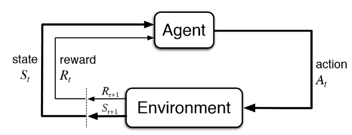
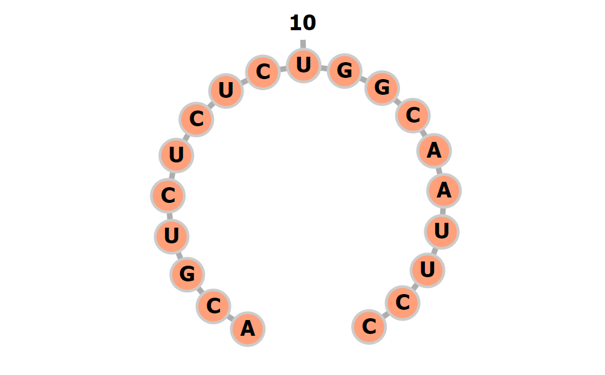

***Written by LeeKH***

# Markov Decision Process For Predict RNA Secondary Structure #2

## 2. RNA Secondary Structure Prediction in Reinforcement Learning

### 2.1 introduction

앞서 이야기 했듯이 강화학습은 머신러닝 분야에서 명시적인 오류를 제시 해주기 힘든 경우, 동적 계획법으로 풀이가 가능하지만 계산량이 너무 많은 경우에 "근사 동적 계획법"으로 문제를 풀이 할 수 있게 한다. 더불어 단기적(Short-Term, Greedy)인 보상에 집중하는 것이 아닌 장기적(Long-Term) 보상을 고려할 수 있게 해준다는 장점을 갖고 있다. 

우리는 앞서 RNA 2차 구조를 RNA 시퀀스 데이터로 부터 예측하기 위해 강화학습을 사용하기로 결정하였다. 또한 강화학습을 설명할 때 보았듯이 어떤 문제(ex. A robot in maze)에 대해 강화학습의 각 속성에 대한 정의를 내리는 것은 이후의 강화학습 알고리즘(ex. Policy Iteration, Policy Search, Q-Learning, etc...)을 사용하기 위한 필수 과정이다.

### 2.2 Reinforcement Learning with RNA Secondary Structure Prediction

#### - $Synopsis$

어떤 사람의 몸 속에 있던 DNA에서 transcription 과정이 일어나며 RNA가 정보 전달을 하기 위해 DNA에서 복제 되어 나오게 된다. 2개 시퀀스가 화학적 결합으로 안정적인 나선형 구조를 갖는 DNA와 달리 RNA는 1개 시퀀스로 불안정한 구조로 존재하고 있다. RNA역시 DNA처럼 안정적인 구조를 갖고 싶기 때문에 과거 나선형 구조에서 A-C, G-U, 등으로 결합하였듯이 이제 스스로 시퀀스 내부의 요소를 서로 결합(Pair)시켜 안정적인 구조로 변화하려 한다

RNA(Agent)는 스스로 Pair를 이루어 궁극적으로 안정적인 2차 구조로 변화하려한다. RNA는 자신의 시퀀스에서 일부를 연결(Action)시켜 Pair로 만들것이다. 

안정적이라는 것은 곧 RNA의 자유에너지를 최소화 하는 방향으로 Pair를 결정 하는 것인데 RNA가 속해있는 환경(Environment)은 이미 RNA의 안정적인 2차 구조에 대해 알고 있다. 하지만 자유에너지를 고려하여 Pair의 정답 유무와 그것의 이유를 명시적으로 설명 하지 못하기 때문에 환경은 그저 RNA가 올바른 Pair를 했는지 하지 못했는지에 대한 정보(Reward)만 알려 줄 수 밖에 없다.

이제 RNA는 자신이 Pair를 고르기(Action)전 자신의 상황(State)과 고른 후의 상황(Next State)등을 모두 고려하며 자유에너지를 최적으로 갖는(=Maximize Rewards) Pair를 선택하는 과정을 학습해야한다. 

#### - $State$ (상태 집합)

RNA의 시퀀스의 길이를 $N$이라고 하자. RNA는 {A, C, G, U}라는 4개의 letter로 구성된다. 여기에 의미를 알 수 없는 letter(데이터의 노이즈) {N}이 추가로 구성된다. 크기가 $N \times 4$인 리스트에 onehot 인코딩 방식으로 정보를 저장하게 한다. RNA 시퀀스의 화학적 정보는 Pair를 결정하는데 하나의 단서가 되기 때문에 RNA가 pair를 선택하는 과정을 학습하는데 필수적으로 제공되어야 하는 정보다. 

RNA 시퀀스를 $Seq$ 라 하고 시퀀스의 길이를 $N$이라고 하자. 시퀀스의 letter를 $Seq_{i}$로 정의하고 letter의 index를 의미하는 $i$ 는  $0 \leq i < N (i \in \Z)$ 범위를 갖는다. 이때 letter가 onehot 인코딩 된 경우를 $X$라고 하면,

$$
TODO: S = OnehotEncodingExporessionInLatex
$$

그리고 추가적인 고려사항은 이미 연결된 Pair들에 대한 정보들이다. 이 Pair들의 정보를 어떤 방식으로 인코딩 할 것인지에 대한 결정은 직접 학습을 시켜봐야 알 수 있는 부분이므로 지금 단계에서는 생각해볼 수 있는 모든 인코딩 방식에 대해 알아본다. 하나는 pair의 유무와 함께 연결 정보를 index로 기록하는 방식이고 다른 하나는 단순히 pair의 유무만 기록하는 방식이다

 1. 시퀀스 길이 $N$ 에서 Pair를 이루는 시퀀스는 각 상대방의 index $j $ $(0 < j \leq N (j \in \Z))$를 갖게 된다. 만약 Pair를 갖지 않는 경우 자신의 index를 표시하며 Pair가 결정되지 않은 시퀀스의 경우 0을 갖는다. 해당 방식의 인코딩을 하는 경우 $N \times 1$ 크기의 리스트로 시퀀스의 pair들에 대한 정보를 기록하게 된다.  

    

    $$
    TODO: P1 = EncodedPairExporessionInLatex
    $$

    

 2. 시퀀스 길이 $N$ 에서 Pair를 이루는지 그렇지 않은지에 대한 정보만을 제공하도록 한다. {True, False} 2가지의 클래스로 시퀀스의 pair들의 정보를 기록하게 한다. 이 경우 1번 방식과 다른 점은 이전 시퀀스들의 정보를 활용하지 않는다는 점이다. 해당 방식의 인코딩은 다음 pair를 결정하기 위해 남은 시퀀스들의 정보만을 고려하게 된다. 마찬가지로 $N \times 1$ 크기의 리스트로 정보를 저장한다. Pair인 경우 1($True$)을, pair가 아닌 경우 0($False$)을 그리고 아직 pair를 결정하지 않은 경우는 0.5로 기록한다

    

    $$
    TODO: P2 = EncodedPairExporessionInLatex
    $$

1번 방식 또는 2번 방식 중 어느것이 나은지는 앞서 말했듯이 실험을 통해 살펴봐야 할 것이다. 이제 시퀀스의 화학적 letter 정보와 현재 시퀀스의 pair들의 정보를 합치면 $N \times 5​$ 크기의 리스트가 된다. 

#### - $Action$ (행동)

RNA는 시퀀스에서 자유에너지가 최소가 되는 방향을 고려하여 Pair를 선택한다. Pair를 선택하는 것은 하나의 정수 쌍을 받는 것과 동일하다. 정수 쌍은 현재 상태 $s_{t}$에서 정책 $\pi(a|s, p)$을 바탕으로 다음 행동 $a_{t}$를 선택한다.

행동 $a_{t}(a \in A)$은 좌표 $(m,n)$으로 구성될 경우, $m$과 $n$은 $0 < m, n \leq N$의 범위를 갖으며 만약 pair를 선택할 경우 두 값은 서로 다른 값이 되어야 한다. 반대로 pair를 선택하지 않을 경우 선택하지 않는 지점의 좌표 $(m,m)$ 또는 $(n,n)$을 선택한다 

#### - $Reward$ (보상)

RNA가 pair를 선택하면 환경(Environment)은 올바른 pair 선택의 유무에 따라 Score를 반환한다. 올바른 pair를 선택한 경우 positive score를, 틀린 pair를 고른 경우에는 zero score를 그리고 범위 밖의 좌표 pair를 고른 경우 negative score를 반환한다 

#### - $Policy$ (정책)

Agent에 해당하는 RNA는 보상을 최대화 하는 정책 $\pi(a|s, p)​$으로 현재 시퀀스($S​$)와 pair($P​$)를 고려해 행동($A​$)을 결정한다.

#### - $Environment$ (환경)

보상과 다음 상태를 넘겨주는 존재가 곧 환경을 의미한다. Agent인 RNA는 환경과 상호작용한다

* RNA는 현재 상태(시퀀스, 구조)에서 자유에너지를 최소로 하는 pair를 선택 한다
* 환경은 RNA가 선택한 pair에 따른 보상과 다음 상태를 제공한다

### 2.3 Reinforcement Algorithm

이제 위와 같은 정의를 바탕으로 

 

## References

- 마르코프 의사 결정 과정 - https://en.wikipedia.org/wiki/Markov_decision_process

- Q 러닝 - https://en.wikipedia.org/wiki/Q-learning

- 강화학습 - https://en.wikipedia.org/wiki/Reinforcement_learning

- RNA 2차 구조 시각화 - http://rna.tbi.univie.ac.at/forna/forna.html

- 강화학습 -  http://web.stanford.edu/class/cs234/index.html

- RNA 2차 구조 -  *RNA Secondary Structures, Ivo L. Hofacker and Peter F. Stadler. Institute for Thoretical Chemistry, Universitiy of Vienna, Wahringerstrasse 17, A-1090 Vienna, Austria. Bioinformatics Group, Department of Computer Science, and Interdisciplinary Center for Bioinformatics, University of Leipzig,*
  *Hartelstrasse 16-18, D-04107 Leipzig, Germany.*

  

  