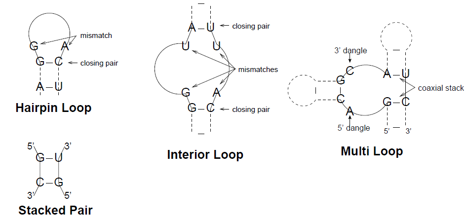
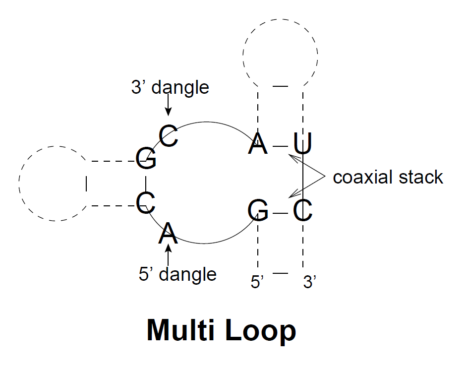

# RNA Secondary Structures (2/7)

**Information from** -  *RNA Secondary Structures, Ivo L. Hofacker and Peter F. Stadler. Institute for Thoretical Chemistry, Universitiy of Vienna, Wahringerstrasse 17, A-1090 Vienna, Austria. Bioinformatics Group, Department of Computer Science, and Interdisciplinary Center for Bioinformatics, University of Leipzig,*
*Hartelstrasse 16-18, D-04107 Leipzig, Germany.*

## 2. Loop-Based Energy Model

### 2.1 Loop decomposition

#### Loops

RNA의 2차 구조는 개별적으로 구분이 가능한 몇 가지의 루프들의 종류로 구성되어 있다. 이는 Planar graph라서 가능한 것으로도 볼 수 있다. 크게 Interior loop와 exterior loop로 구분된다

#### Interior Loop & Immediately interior

시퀀스의 위치를 나타내는 k가 immediately interior이려면 pair인 ( i , j )에 대하여 i < k < j 이고 i < p < k < q < j 를 만족하는 다른 base pair ( p , q )가 없어야 한다. 그리고 ( i , j )가 closing pair인 경우 모든 k를 만족하는 위치 값들을 immediately interior 라고 한다

#### Exterior Loop

Exterior loop는 interior pair가 아닌 position들을 내포하고 있는 경우를 의미한다

#### Pseudoknot Free Structures

Loop들이 minimal cycle로 구성되는 secondary structure graph라는 basis를 바탕으로 하는 경우 pseudoknot free structure라고 한다. 즉 pseudoknot를 제외하고 구조화 시키는 것이다

#### Degree에 따른 Loop의 정의

Loop는 그 특징을 해당 loop의 길이 값으로 정의가 가능한데 예를 들면 loop내의 unpaired nucleotide들의 개수를 loop의 차수(degree)로 정의한다. 그리고 이 degree의 수치에 따라 loop를 몇 가지로 분류 하고 있다.

* Degree가 1인 경우 hairpin loop라고 한다
* Degree가 2인 경우 interior loop라고 한다
* Degree가 2 이상인 경우 multi loop라고 한다

아래의 그림은 RNA 2차 구조에서 주요하게 다뤄지는 일부 loop들이다.

#### Standard Energy Model for RNA Secondary Structures

이러한 loop의 decomposition작업들을 통해 RNA 2차 구조를 위한 표준 에너지 모델을 정의 할 수 있다. 2차 구조의 전체 free energy(자유 에너지)는 loop의 구성성분의 합으로 볼 수 있다. 이는  helix 내 base pair의 에너지 기여가 pair들과 연결되는 다른 pair들에 의존적이기 때문이다. 그리고 이러한 모델을 종종 nearest neighbor 모델이라고 부르기도 한다.

이를 토대로, 자유에너지가 가장 적을때 구조가 안정화 된다는 점을 활용하면 구조를 예측하는 방안에 사용 할 수 있다

 

### 2.2 Energy Parameters

2차 구조 모델은 접힘 상태와 접히지 않은 상태의 자유 에너지 차이를 고 염분 농도의 실험 환경에서 관측 가능하다. 이런 energy parameter들은 실험을 통해 경험적으로 측정된 값들이다. 핵심은 구조가 안정화 되는 자유 에너지를 활용 한다는 점이다. 위 그림은 energy parameter의 예시이다

#### Loop Energy formula

일반적으로, loop 에너지들은 loop의 크기나 종류에 의존적이다. 심하게 작은 loop를 제외한다면,  아래와 같은 공식으로 수식화 할 수 있다

$$  E_{loop} = E_{mismatch} + E_{size} + E_{special}$$

mismatch 에너지는 닫힌 loop 내부의 unpaired base들로 부터 계산 되는 값이며 이 base pair들은 immediately interior이다. 마지막에 있는 special 에너지는 특이한 형태의 loop(ex. tetra loops)같은 경우에서 사용될 일종의 보너스 에너지다. Size 에너지는 말 그대로 2차 구조의 크기에 따른 에너지 계산 값이다. 이 수치는 logarithmically하게 증가해야하나 실제로 multi loop에서 loop사이즈와 loop 차수는 선형적 특성을 갖는다. 이는 2차 구조 예측을 위한 효율적인 dynamic programming을 수행하기 위함이다. 그리고 본 자료에서의 2차 구조 모델은 Watson-Crick 결합과 Wobble 결합만 고려한다

### 2.3 Notes

Multi loop 내의 인접한 나선형 구조는 single extended helix를 구성하기 위해 co-axially, 공통된 축으로, 쌓일 수 있다고 한다. 

대표적인 예시로 tRNA들이 이러한 특성을 가진다. 이러한 결과들은 RNA 3차 구조 형성 과정으로 볼 수 있다.  즉 이 과정은 2차 구조 모델에서 다루어야 할 범위를 벗어난다. 단순히 base pair들의 리스트로 이러한 loop끼리의 에너지 계산을 수행하기에 충분하지 않다고 한다. 그리고 이러한 co-axially stacking을 알고리즘에서 고려하는 것 역시 까다롭다고 한다. 이는 다른 기법을 활용해 해결해야할 사항으로 보여진다(머신러닝, 딥러닝 등). 

