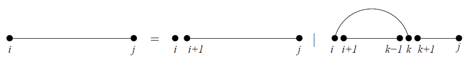
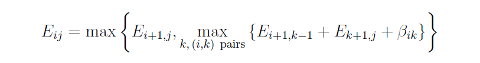
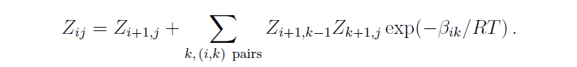

# RNA Secondary Structures (3/7)

**Information from** -  *RNA Secondary Structures, Ivo L. Hofacker and Peter F. Stadler. Institute for Thoretical Chemistry, Universitiy of Vienna, Wahringerstrasse 17, A-1090 Vienna, Austria. Bioinformatics Group, Department of Computer Science, and Interdisciplinary Center for Bioinformatics, University of Leipzig,*
*Hartelstrasse 16-18, D-04107 Leipzig, Germany.*

## 3. The RNA Folding Problem

### 3.1 Counting structures and maximizing base pairs

#### Formulas

Dynamic programming sequences

i 번째에서 j 번째 까지의 Subsequence를 x[ i ... j ] 라고 표기한다. 그림으로 표현하면 위 그림의 제일 좌측의 sequence이다. 그리고 empty sequence를 x[ j + 1 .. j ]라고 표기하도록 한다. 

i 번째 시퀀스에서 i < k < j 에 해당하는 어떤 k와 pair를 이루는경우와 i 번째 시퀀스가 다른 시퀀스와 pair를 이루지 않는 2가지 경우만 존재한다고 생각해보자. i < k < j 를 조건으로 건 이유는 pseudoknot free model이기 때문이다.

> *Pseudoknot free model(pseudoknot 형태를 제외 시키는 모델)을 사용하는 이유는 pseudoknot과 같은 pair의 연결은 RNA Tertiary Structure로 나아갈 경우 고려해야하는 상황으로 보기 때문이다*

위와 같이 2가지로 분화되는 sub-sequence들의 모든 2차 구조 개수들의 모든 개수인 $N_{i,j}$를 아래와 같이 정의 할 수 있다.

(단, $N_{i,i} = 1$이다)

2개로 분화된 sub-sequence들의 모든 2차 구조 개수는 재귀적으로 동일하게 그 개수를 계산이 가능하며 개별 조합에서 생기는 경우의 수는 간단하게 곱셈으로, 별도의 pair가 없는 subsequence의 2차 구조는 덧셈으로 계산이 가능하다.

>  *과거에도 2차 구조를 Dynamic programming으로 시도하는 연구가 진행되어 왔었다. 1970년대에 이와 같은 방식으로 간단한 조합의 구조는 M. Waterman에 의해 밝혀졌다.*

이전에 2차 구조 예측을 2차 구조 상에서 base pair들의 개수가 최대가 되도록 하는 방향으로 시도한 경우가 있었다. 이를 Nussinov 알고리즘이라 하며 위의 재귀적 조합 방식과 유사하다. Sub-sequence x[ i ... j ]의 2차 구조 내에서 base pair들의 최대 개수를 $E_{i,j}$라고 하자

2차 구조 성분을 분해해서 각각의 구조에 대해서 재귀적으로 계속해서 optimal을 찾아 나가면 $E_{i,j}$를 optimal한 값으로 정의 할 수 있다. 한 가지 명심해야 하는 것은 분화 된 2차 구조는 각각 독립적으로 분화 되어 나간다는 점이다. 이는 앞에서도 말했지만 pseudoknot free라는 기준이 있기 때문이다.

그리고 특정 base pair( i , j )에 대해서 해당 pair의 가중치, 중요도를 설정할 수 있다. Negative energy로 표현되는 이 값은 $\beta_{i,j}​$로 표기 하며 당연히 $x_{i}, x_{j}​$에 의존적인 값이 된다. 

이제 $E_{i,j}$의 최대값을 계산하기 위한 재귀적인 수식을 생각해보자. 총 2가지 경우로 분화 되므로 두가지 경우에 대해서 더 큰 값을 선택하면 된다. pair가 없는 경우에는 단순히 $E_{i+1,j}​$의 값을 사용하면 된다. 

만약 전자와 다르게 pair를 이루는 경우에 대해서는 어떻게 해야하는가? 당연히 모든 가능한 pair position $k​$를 고려해봐야 한다.  

즉, 고려 할 수 있는 모든 pair의 경우에서 만들어지는 base pair의 최대 개수는 $E_{i+1,k-1} + E_{k+1, j}$값으로 정의 할 수 있으며 여기에 energy 개념을 도입하기 위해  $\beta_{i,k}$값을 함께 더해준다. 그 결과 $E_{i,j}$를 계산하기 위한 재귀적 수식(1)은 아래와 같다.

여기서 가중치 값을 대신하는 binding energy들로 대체 한다면 (binding energy 값은 음수 값에서 안정된 상호작용을 하는 값으로 본다) max 값을 min으로 바꿈으로서 동일한 수식으로 치환이 가능하다. 하지만 이런 간단한 에너지 모델로는 실질적인 효과를 보지 못하며 이에 대한 더 디테일한 부분은 3.3절에서 다루도록 한다.

이어서 활용되는 이론은 에너지 평형에 관한 이론이다. 비유하자면, 개별 base pair들의 에너지 기여가 마치 실온에서의 열 에너지가 평형을 이루려는 성질과 비슷한 감이 있다

>  열 평형을 맞추려고 에너지가 이동하듯이 RNA single strand역시 스스로 접혀 안정적인 구조로 변하게 된다

열역학의 평형상태에서 특정 구조 $\Psi$ 가 될 확률은 Boltzman factor $-exp(-E(\Psi) / RT)$와 비례한다. 

* $E(\Psi)​$ 는 어떤 형태 $\Psi​$에서 (여기서는 2차 구조를 의미)의 에너지를 의미
* $R​$ 은 molar gas constant를 의미한다(molar unit의 볼츠만 상수)
* $T​$ 는 상온에서의 켈빈 온도를 의미한다

이 구조가 결합된 구조체(ensemble of structures) 는 그것의 partition function $Z$로 결정된다. 

 

그리고 sub-sequence $x[i..j]$에서 가능한 모든 2차 구조에 대한 partition function을 $Z_{i,j}$로 볼 경우 아래와 같은 식을 얻을 수 있다.

위 식은 $E_{i,j}$를 계산하는 수식(1)에서 $E_{i,j}$부분을 $Z_{i,j}$로 대신함과 동시에 max는 sum으로, sum 부분은 multiplication으로 그리고 에너지 값은 그에 대응하는 Boltzman factor로 대체된 수식이다.

그리고 이 partition function은 *equilibrium probability of a structure* $\Psi$ 를 아래 수식으로 계산할 수 있도록 해준다. 

*  $p(\Psi) = exp(-E(\Psi)/RT)/Z$ ($\Psi​$를 2차 구조라고  가정한다) 

이러한 formalism은 base pair $p(i,j)$의 equilibrium probability를 계산하는데 효율적으로 사용된다. 계산 수식은 아래와 같다

* $p(i,j) = \Sigma_{(i,j) \in \Psi}p(\Psi)​$

그리고 위 수식을 정리 하기 위해서는 sub-sequence의 외부 구조들에 대한 partition function인 $\hat{Z}_{i,j}​$ 더 필요하다. 이것까지 모두 고려 한다고 가정한다면 아래와 같은 수식을 정리 할 수 있다.

Pair(i,j)가 내포하는 모든 구조들에 대한 모든 확률 값들을 위의 수식으로 표현하였다. 이 수식에 대한 다른 형태는 5.5절에서 좀 더 다루도록 한다.

