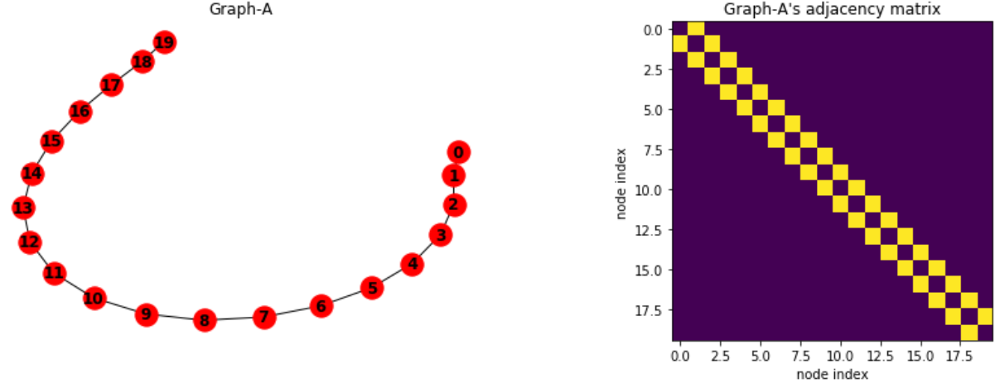
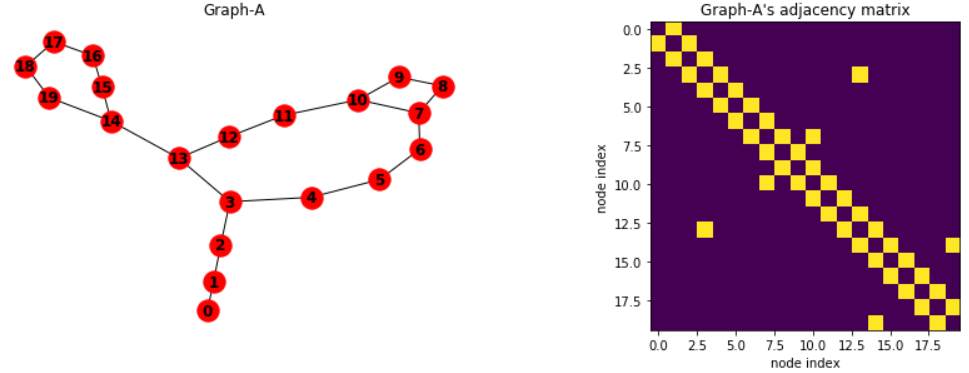
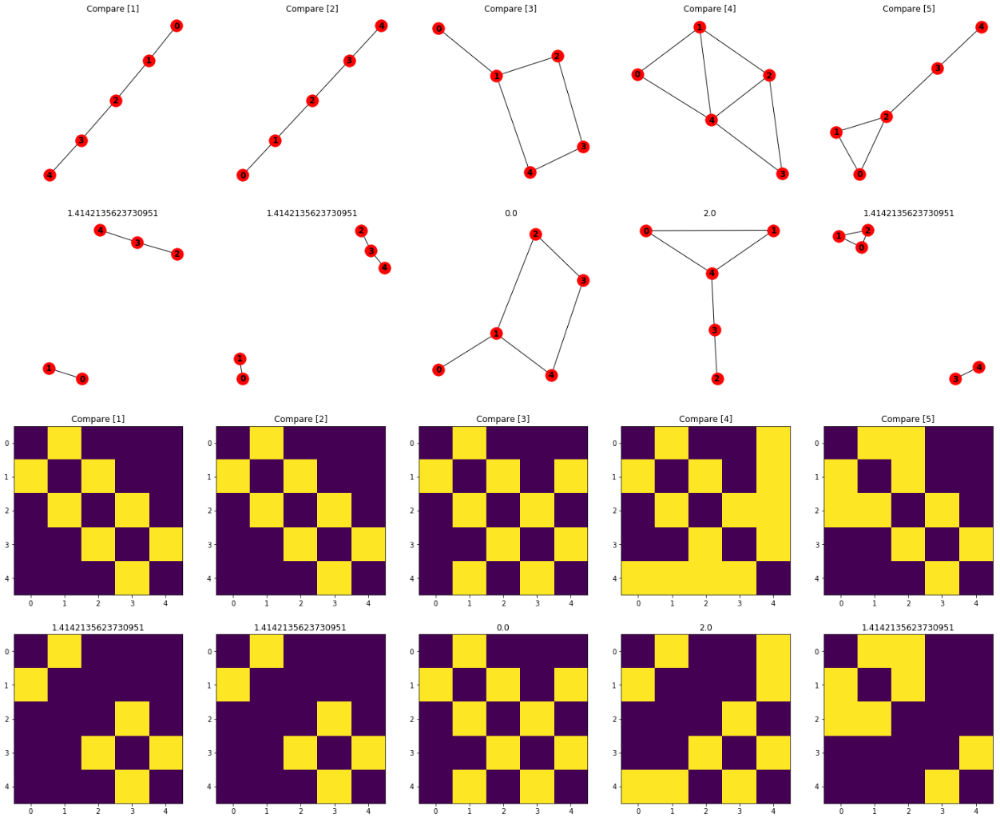
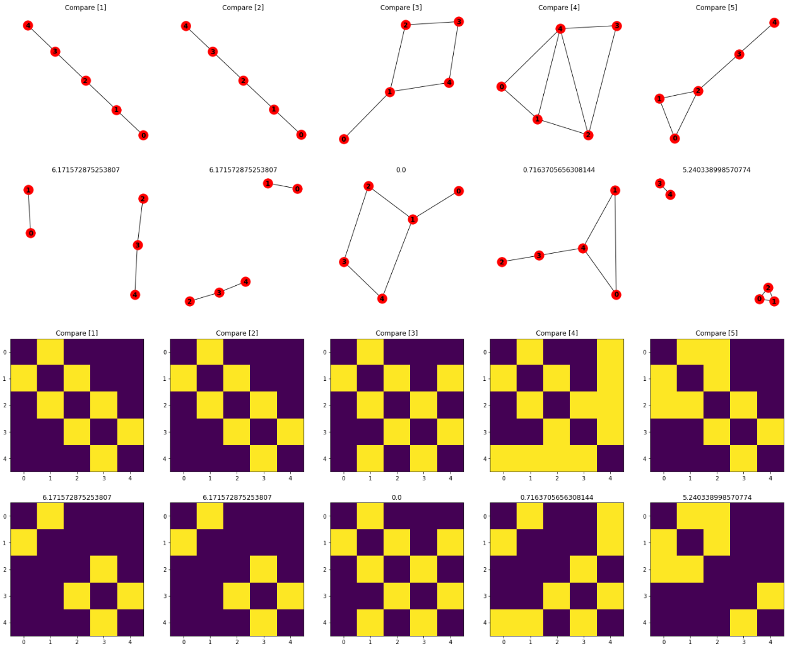

***Written by LeeKH***

# Graph Structure's Similarity methods

해당 글에서는 RNA 2차 구조가 갖는 planar graph의 구조적 유사성을 비교하는 방법을 알아보기 위해 무작위로 RNA 2차 구조와 유사한 planar graph를 생성하고 다양한 유사성 비교 방법(similarity method)에 대해 알아보고 실험해본다

## Default planar graphs for similarity test

우선 이 실험은 RNA 2차 구조의 유사성을 측정하기 위해 일반적인 그래프로 실험을 해보는 것이다. 따라서 실험대상이 되는 그래프의 기본 형태를 RNA 2차 구조와 유사하게 설정한다. 그 규칙은 다음과 같다

1. 길이 N을 갖는 노드는 모두 연결되어 있다. 이는 RNA 시퀀스가 연결되어 있는 것을 묘사한 것이다

   

2. 각 노드는 (1)에서 보여준 시퀀스의 기본 연결을 제외하고 각 노드끼리 하나의 연결만을 갖는다

## Euclidean Similarity

해당 유사도 측정 방법은 유클리드 거리(Euclidean Distance)를 기반으로 하는 유사도 측정 방법이다. 간단히 두 벡터의 유클리드 거리를 구해서 유사도로 사용하는 방법이다. 본 실험에서는 벡터가 아니라 N x N 크기의 인접행렬(adjacency matrix)로 구성된 두 그래프의 유사도를 비교하므로 해당 행렬을 벡터대신 사용한다

$$
EuclideanSim(x,y) = - d(x,y) = -\sqrt{(x_1 - y_1)^2 + (x_2 - y_2)^2 ... (x_n - y_n)^2}
$$

Inverse distance로 표현되므로 0에 가까울수록, 값이 클수록 유사도가 높다. 가장 기본적인 방법 중 하나지만 인접행렬로 구한 euclidean similarity는 단순히 edge들의 매칭 정도로만 해석이 가능하다. 그래프의 구조 특성까지 포함하는 유사도 측정 방법을 찾을 필요가 있다

## Cosine Similarity

Cosine similarity는 두 non-zero 벡터의 내적 공간(inner product space)의 사이 각도의 cosine 값을 사용한 유사도 측정 방법이다.  즉 방향성에 대한 유사도를 어느정도 측정할 수 있는 방법이다. 동일한 방향을 바라보는 두 벡터에 대해서는 사이 각도가 0이므로 cosine similarity 값이 1이 된다

해당 실험에서는 두 벡터가 아닌 두 행렬에 대해서 cosine similarity를 측정한다. 우선 두 벡터에 대한 수식은 아래와 같다

$$
similarity = cos(\theta) = \frac{A \cdot B}{\parallel A \parallel \parallel B \parallel} = \frac{\sum_{i=1}^{n} A_i B_i}{\sqrt{\sum_{i=1}^{n}A^2_i} \sqrt{\sum_{i=1}^{n}B^2_i}}
$$

위 식을 사용한 유사도 결과 값은 앞서 말했듯이 방향에 관한 특성을 어느정도 갖는다. 대표적으로 -1은 완전 반대라는 뜻이며, 0은 orthogonal 혹은 상관관계가 없음을 의미하며 1은 완전 똑같음을 의미한다. 두 행렬을 해당 식에 적용하기 위해 1차원 벡터로 재배열하여 사용한다

## Eigenvalues Similarity

위 두 방법은 두 벡터사이의 유사성을 측정하기위해 기본적으로 많이 사용하는 방법이다. 참고한 논문 [1]에 따르면 eigenvalue를 사용하는 방법에는 인접행렬의 laplacian을 구해 해당 행렬의 eigenvalue를 계산하고 그 차이를 사용해 유사도를 측정한다

$$
sim = \sum_{i=1}^{k}(\lambda_{1i} - \lambda_{2i})^2
$$

[1]에서는 eigenvalue의 energy값이 90% 이상인 값들만 사용한다고 명시되어 있으나 우선 모든 eigenvalue를 사용해 유사도를 측정해보기로 한다

## Results

각 유사도 측정 방법에 대해 실험한 결과를 위 그림에 각 방법별로 표시하였다. Eigenvalue Similarity가 그래프 구조 변화에 민감하게 반응하는 것을 확인 할 수 있다. 각 상,하 그래프 사이의 수치가 유사도 측정 값이다. 그래프 아래 그림은 인접행렬을 시각화한 결과이다. 마찬가지로 행렬 사이 수치가 유사도 측정 값을 보여주고 있다 

## References

[1]  A. R. Danai Koutra, Ankur Parikh and J. Xiang, “Algorithms for graph similarity and subgraph matching,” (2011)